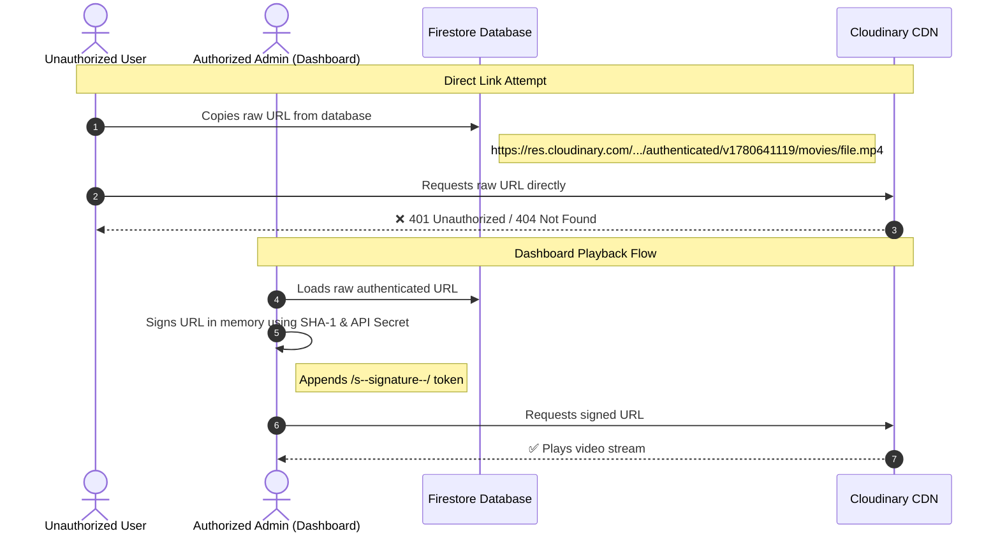

# Video Security Guide & Cloudinary Authenticated Delivery

This guide explains how we secured video assets in the AVR Cinema Dashboard to prevent direct playback from public database URLs, ensuring that only authorized users can stream the content.

---

## 🔒 How Video Security Works

We have implemented **Cloudinary Authenticated Delivery** for all video files (movies, trailers, and series episodes).



1. **Secure Storage**: During upload, files under video folders (`movies`, `videos`, `episodes`) are sent with `type: "authenticated"`. Cloudinary restricts public access to these files.
2. **Signature Stripping**: When Cloudinary responds to an upload request, it returns a URL containing a temporary `s--` signature. We **strip** this signature segment (`/s--[^/]+--/`) from the URL *before* saving it to Firestore.
3. **Clean Database URLs**: The URL stored in the Firestore database is the clean, unsigned authenticated URL. E.g.:
   `https://res.cloudinary.com/dgc6djwya/video/authenticated/v1780642013/movies/mki0q57zdsmdq2xkgbyi.mp4`
   If someone copies this URL directly from Firestore, they **cannot** play it.
4. **Manual Paste Stripping**: If an admin manually pastes a signed URL into the forms (for a Movie, Trailer, or TV Show Episode), the dashboard automatically strips the signature from the URL before writing it to Firestore.
5. **Dynamic URL Signing**: To play the video, the dashboard generates a cryptographic signature on-the-fly using the Web Crypto API and the `VITE_CLOUDINARY_API_SECRET` in memory. E.g.:
   `https://res.cloudinary.com/dgc6djwya/video/authenticated/s--lhruz79x--/v1780641119/movies/lhruz79xqf68cvrxhrzh.mp4`

---

## ⚡ Verifying Your Security

To confirm that the security is active:
1. **Upload or add a video** (movie, trailer, or episode) in the dashboard's media editor.
2. Open your Firestore Database console and find the newly created/updated media document.
3. Verify that the saved URL **does not** contain the `/s--...--/` segment.
4. Copy the URL string from Firestore and paste it directly into a new incognito browser tab. You should see:
   ```json
   { "error": { "message": "Resource not found" } }
   ```
5. Go back to the admin dashboard, click **Preview** on that asset, and verify that the video plays successfully inside the authorized dashboard previewer.

---

## 🔄 Migrating Existing Public Videos

Any videos uploaded before this security configuration was added are stored as public assets (`/upload/`).

To secure your existing media catalog:
1. **Locate the asset** in the dashboard media listing.
2. Click the **Edit** button.
3. Under **Video Trailer** or **Movie Stream Source**, select **File**.
4. Re-upload the video file.
5. Click **Update Catalog**.
This will upload the file as `authenticated`, strip the initial signature, and replace the public `/upload/` URL in Firestore with the secure `/authenticated/` URL.

---

## 📱 Integrating with Your Customer-Facing Application

Since the customer-facing application needs to play these secure movies but **must not** expose the raw `API Secret` in its client bundle, you should use one of the following two patterns:

### Option A: Secure Backend Proxy (Recommended)
Your frontend requests the signed URL from your own backend API endpoint, which keeps the API Secret secure:

```javascript
// Customer Frontend App
const playMovie = async (movieId) => {
  const response = await fetch(`https://api.yourdomain.com/movies/${movieId}/stream-url`, {
    headers: { 'Authorization': `Bearer ${userToken}` }
  });
  const { signedUrl } = await response.json();
  videoPlayer.src = signedUrl;
};
```

On your backend (Node.js/Express), generate the signature using the Cloudinary SDK:
```javascript
// Backend API Endpoint
const cloudinary = require('cloudinary').v2;

cloudinary.config({
  cloud_name: process.env.CLOUDINARY_CLOUD_NAME,
  api_key: process.env.CLOUDINARY_API_KEY,
  api_secret: process.env.CLOUDINARY_API_SECRET,
  secure: true
});

app.get('/movies/:id/stream-url', checkUserAuth, async (req, res) => {
  const movie = await getMovieFromFirestore(req.params.id);
  
  // Generate a signed URL with 1-hour expiration
  const signedUrl = cloudinary.url(movie.movieUrl, {
    sign_url: true,
    type: 'authenticated',
    resource_type: 'video',
    expires_at: Math.floor(Date.now() / 1000) + 3600 // 1 hour
  });
  
  res.json({ signedUrl });
});
```

### Option B: On-the-Fly Front-End Signing (For Admin/Secure Apps Only)
If the application is fully protected (like this Admin Dashboard) and has secure access to environment variables, you can reuse the native JavaScript signer function we created:

```typescript
import { getSignedUrl } from '@/Firebase';

// Usage in player component
const playVideo = async (rawUrl: string) => {
  const secureUrl = await getSignedUrl(rawUrl);
  setPlayerSource(secureUrl);
};
```
